# 🌾 Sistema de Recomendación de Cultivos - Proyecto ML

## 📋 Descripción del Proyecto

Este proyecto desarrolla un sistema inteligente de Machine Learning para recomendar el cultivo más adecuado basándose en parámetros agroclimáticos y propiedades del suelo. Utiliza la metodología **CRISP-DM** (Cross-Industry Standard Process for Data Mining) y está implementado en Python con Jupyter Notebooks.

### 🎯 Objetivo

Predecir el cultivo óptimo para sembrar considerando:
- Nutrientes del suelo (N, P, K)
- Condiciones climáticas (Temperatura, Humedad, Precipitación)
- Propiedades químicas (pH)

### 📊 Dataset

- **Fuente**: [Kaggle - Crop Recommendation Dataset](https://www.kaggle.com/datasets/atharvaingle/crop-recommendation-dataset)
- **Tamaño**: 2,200 muestras
- **Características**: 7 variables numéricas
- **Clases**: 22 tipos de cultivos

## 🗂️ Estructura del Proyecto

```
proyecto-recomendacion-cultivos/
│
├── README.md                         # Este archivo
├── requirements.txt                  # Dependencias de Python
│
├── notebooks/
│   ├── 1_bu_du_eda.ipynb             # Fase 1 CRISP-DM
│
├── src/
│   ├── __init__.py
│   ├── procesamiento_datos.py        # Utilidades de datos
│   ├── ingenieria_features.py        # Feature engineering
│   ├── entrenamiento_modelo.py       # Entrenamiento
│   └── evaluacion.py                 # Métricas y evaluación
│
├── modelos/                          # Modelos guardados
│   ├── label_encoder.pkl
│   ├── scaler.pkl
│   └── mejor_modelo.pkl
│
├── reportes/
│   ├── figuras/                      # Visualizaciones
│   ├── reporte_entrega1.pdf
│   ├── reporte_entrega2.pdf
    └── reporte_final.pdf
```

## 🚀 Inicio Rápido

### 1️⃣ Requisitos Previos

- Python 3.12 o superior
- pip (gestor de paquetes de Python)
- Git

### 2️⃣ Instalación

```bash
# Clonar el repositorio
git clone <url-del-repositorio>
cd proyecto-recomendacion-cultivos

# Crear entorno virtual
python -m venv venv

# Activar entorno virtual
# En Windows:
venv\Scripts\activate
# En Linux/Mac:
source venv/bin/activate

# Instalar dependencias
pip install -r requirements.txt
```

### 3️⃣ Ejecutar los Notebooks

```bash
# Iniciar Jupyter Notebook
jupyter notebook

# O usar Jupyter Lab
jupyter lab
```

Ejecutar los notebooks en orden:
1. `1_bu_du_eda.ipynb`


## 📅 Cronograma de Entregas

### Entrega 1 - 02/10/2025 (5%)
- ✅ Notebook de EDA completo
- ✅ Data Card del dataset
- ✅ Modelo baseline (Regresión Logística)
- ✅ Reporte PDF breve
- ✅ Repositorio Git

**Contenido**: Notebooks `1_bu_du_eda.ipynb`

### Entrega 2 - 09/10/2025 (10%)
- ✅ Comparación de 2-3 familias de modelos
- ✅ Pipelines de entrenamiento
- ✅ Validación cruzada
- ✅ Análisis de hiperparámetros
- ✅ Reporte de resultados

**Contenido**: 

### Entrega 3 - 05/11/2025 (20%)
- ✅ Modelo final optimizado
- ✅ Interpretación del modelo (SHAP)
- ✅ Reporte final completo
- ✅ Póster del proyecto
- ✅ Presentación

**Contenido**: 

## 🎯 Metodología CRISP-DM

### Fase 1: Comprensión del Negocio
- Definición del problema
- Objetivos y criterios de éxito
- Análisis de stakeholders

### Fase 2: Comprensión de los Datos
- Análisis Exploratorio de Datos (EDA)
- Estadísticas descriptivas
- Identificación de patrones
- Data Card

### Fase 3: Preparación de los Datos
- Limpieza de datos
- Manejo de outliers
- Escalado de características
- División train-test

### Fase 4: Modelado
- Modelo baseline (Regresión Logística)
- Árboles de Decisión
- Random Forest
- XGBoost / LightGBM
- SVM
- Ajuste de hiperparámetros

### Fase 5: Evaluación
- Métricas: Accuracy, Precision, Recall, F1-Score
- Matriz de confusión
- Validación cruzada
- Comparación de modelos
- Interpretabilidad (SHAP)

### Fase 6: Despliegue
- Serialización del modelo
- API de predicción (opcional)
- Documentación
- Recomendaciones

---

## 🔧 Conceptos Clave de Machine Learning

### 🎛️ Optimización de Hiperparámetros

#### ¿Por qué Optimizar Hiperparámetros?

Los valores por defecto de los algoritmos de ML rara vez son óptimos para un problema específico. La optimización de hiperparámetros busca encontrar la mejor configuración del modelo.

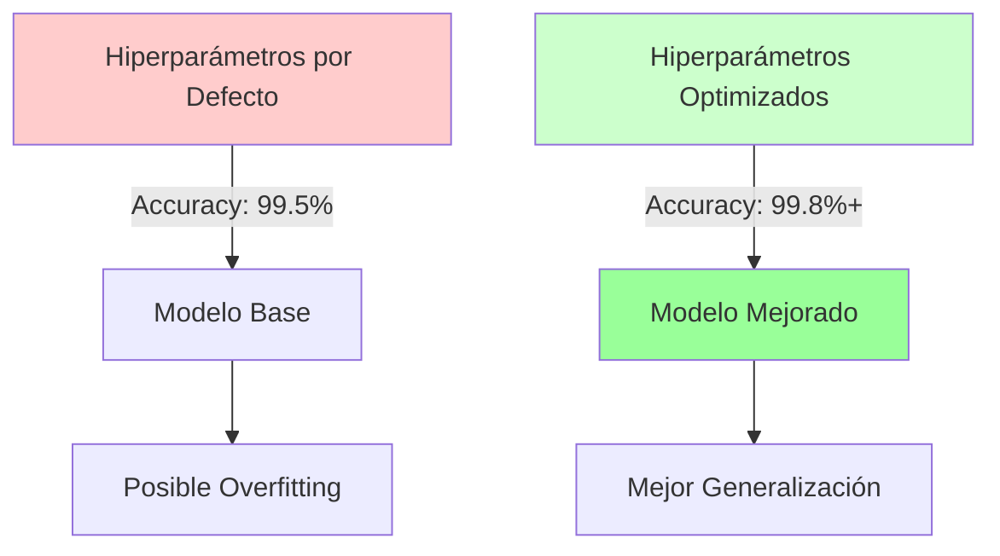

**Beneficios de la optimización:**
- ✅ **Mejorar accuracy**: Típicamente +0.5% a +3% de mejora
- ✅ **Reducir overfitting**: Modelos que generalizan mejor
- ✅ **Acelerar entrenamiento**: Configuración más eficiente
- ✅ **Aumentar estabilidad**: Predicciones más consistentes

#### Técnicas de Optimización

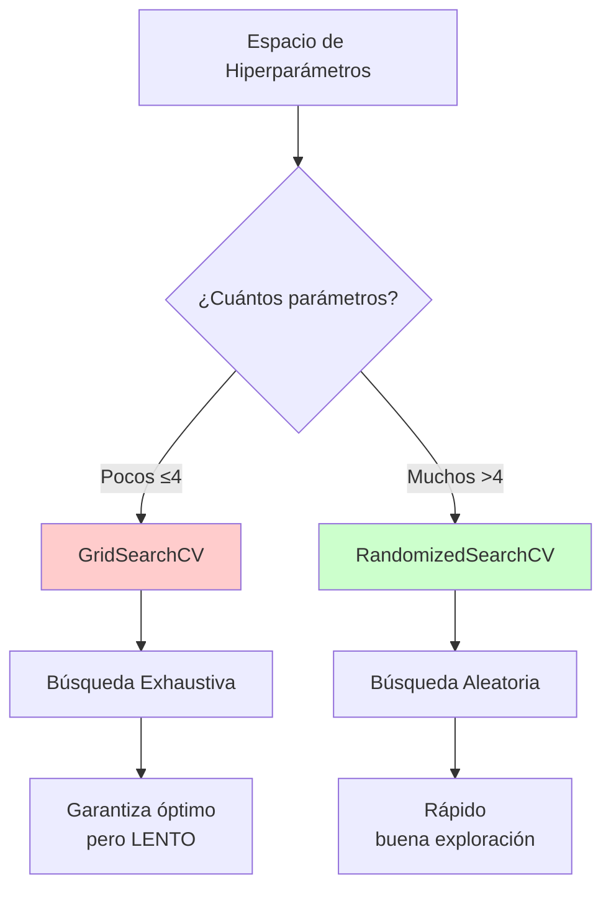

| Técnica | Descripción | Cuándo Usarla | Ventajas | Desventajas |
|---------|-------------|---------------|----------|-------------|
| **GridSearchCV** | Búsqueda exhaustiva en grilla de valores | Pocos hiperparámetros (≤4) | Encuentra el óptimo global | Muy lento, crecimiento exponencial |
| **RandomizedSearchCV** | Búsqueda aleatoria en distribuciones | Muchos hiperparámetros (>4) | Mucho más rápido, buena exploración | No garantiza el óptimo global |

#### Validación con K-Fold Cross-Validation

**Importante**: Los hiperparámetros se optimizan usando **K-Fold Cross-Validation** sobre el conjunto de entrenamiento. Nunca se debe usar el Test Set para optimización (causa data leakage).

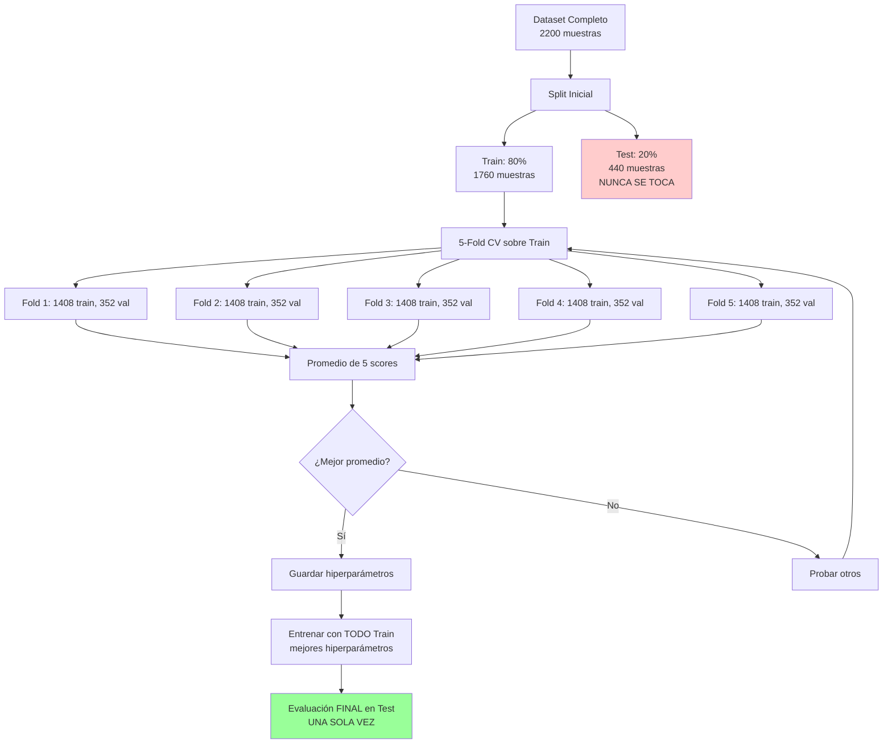

**¿Por qué K-Fold CV?**

| Método | Train | Validation | Test | Evaluaciones | Robustez |
|--------|-------|------------|------|--------------|----------|
| **Hold-out (60/20/20)** | 60% | 20% | 20% | 1x | ⚠️ Inestable |
| **K-Fold CV (80/20)** | 64% (promedio) | 16% (promedio) | 20% | 5x | ✅ Robusto |

Ventajas de K-Fold CV:
- ✅ Usa más datos para entrenar (64% vs 60%)
- ✅ Score más confiable (promedia 5 evaluaciones)
- ✅ Reduce varianza (menos dependiente de un split específico)

#### Ejemplo Práctico: Random Forest

```python
from sklearn.model_selection import RandomizedSearchCV
from sklearn.ensemble import RandomForestClassifier

# Definir espacio de búsqueda
param_grid = {
    'n_estimators': [50, 100, 200, 300, 500],
    'max_depth': [10, 20, 30, 40, None],
    'min_samples_split': [2, 5, 10],
    'min_samples_leaf': [1, 2, 4]
}

# RandomizedSearchCV con K-Fold CV
rf_search = RandomizedSearchCV(
    RandomForestClassifier(random_state=42),
    param_distributions=param_grid,
    n_iter=50,              # 50 combinaciones aleatorias
    cv=5,                   # 5-Fold Cross-Validation
    scoring='accuracy',
    n_jobs=-1,
    random_state=42
)

# Entrenar (K-Fold CV automático)
rf_search.fit(X_train, y_train)

# Mejores hiperparámetros
print(f"Best params: {rf_search.best_params_}")
print(f"Best CV score: {rf_search.best_score_:.4f}")

# Evaluar UNA VEZ en Test
print(f"Test score: {rf_search.score(X_test, y_test):.4f}")
```

#### Objetivo en este Proyecto

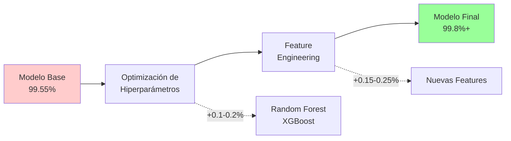

**Modelos a optimizar:**
- **Logistic Regression**: GridSearchCV (C, penalty, solver)
- **Decision Tree**: RandomizedSearchCV (max_depth, min_samples_split, criterion)
- **Random Forest**: RandomizedSearchCV (n_estimators, max_depth, min_samples)
- **XGBoost**: RandomizedSearchCV (learning_rate, max_depth, subsample, colsample_bytree)

---

### 🧬 Feature Engineering (Ingeniería de Características)

#### ¿Qué es Feature Engineering?

**Feature Engineering** es el proceso de crear nuevas características (features) a partir de las existentes usando conocimiento del dominio, para mejorar el rendimiento del modelo.

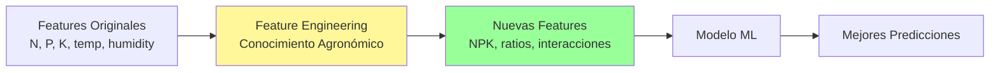

**Principio clave**: *"Los datos correctos vencen a los algoritmos sofisticados"*

#### ¿Por qué es Importante?

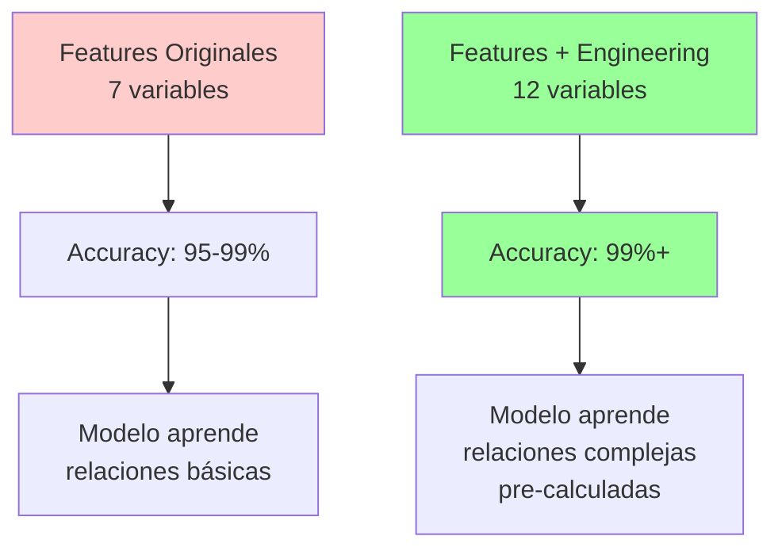

**Beneficios:**
- ✅ **Mejora rendimiento**: +1% a +5% de accuracy
- ✅ **Captura relaciones ocultas**: Sinergia entre variables
- ✅ **Mejora interpretabilidad**: Features con significado agronómico
- ✅ **Reduce complejidad**: El modelo aprende más fácil

#### Tipos de Features en este Proyecto

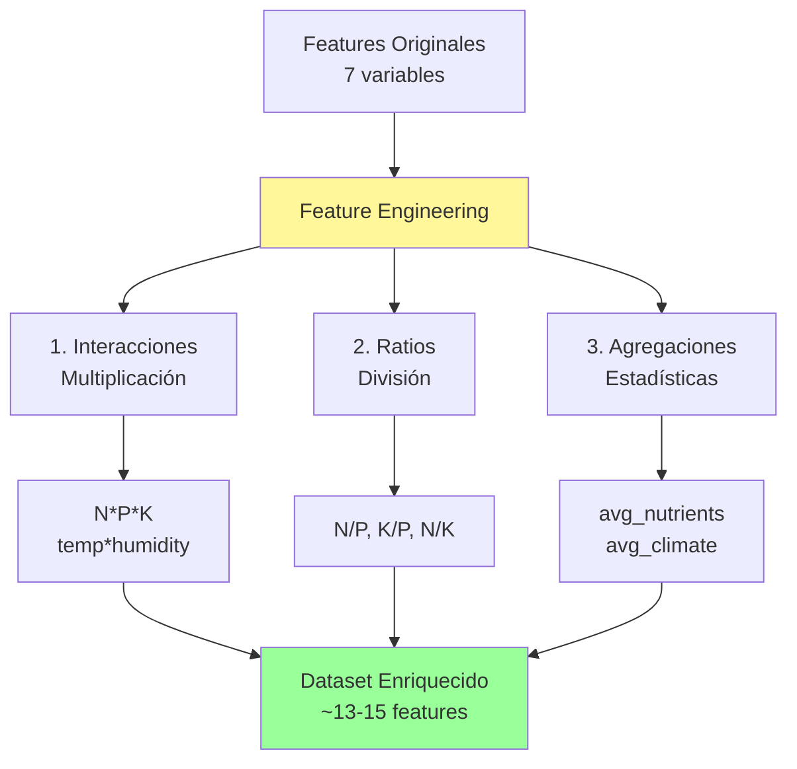

##### 1. Features de Interacción (Multiplicación)

Capturan **sinergia** entre variables:

```python
# NPK: Índice de fertilidad total (sinergia de nutrientes)
df['NPK_total'] = df['N'] * df['P'] * df['K']

# Índice de estrés climático (interacción temp-humedad)
df['temp_humidity_index'] = df['temperature'] * df['humidity']

# Interacción N-P (correlación alta detectada en EDA)
df['NP_interaction'] = df['N'] * df['P']
```

**Justificación agronómica:**

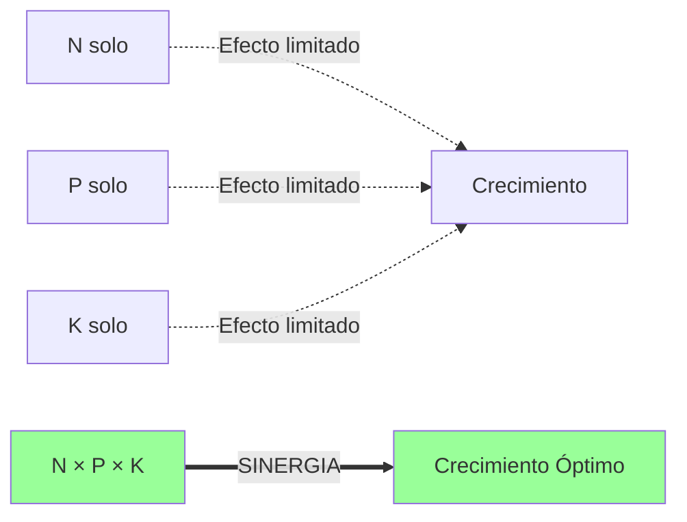

- Los nutrientes trabajan en **sinergia**: la falta de uno limita el efecto de los otros
- Temperatura y humedad combinadas determinan el estrés de la planta

##### 2. Features de Ratios (Divisiones)

Capturan **balances** entre variables:

```python
# Ratios de nutrientes
df['N_P_ratio'] = df['N'] / (df['P'] + 1e-5)  # +epsilon evita división por 0
df['K_P_ratio'] = df['K'] / (df['P'] + 1e-5)
df['N_K_ratio'] = df['N'] / (df['K'] + 1e-5)
```

**Justificación agronómica:**

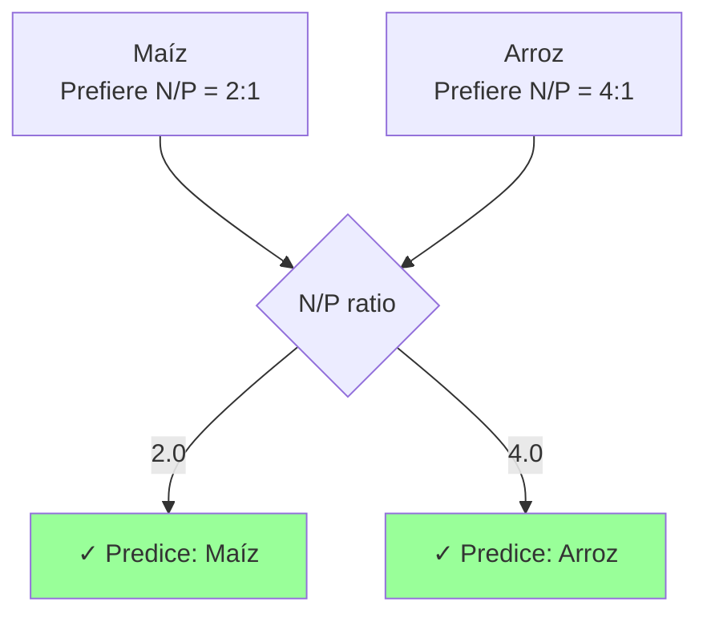

- Los cultivos necesitan **proporciones específicas**, no solo cantidades absolutas
- Un ratio N/P de 2:1 es ideal para maíz, pero 4:1 para arroz

##### 3. Features Agregadas

Estadísticas resumen:

```python
# Promedio de nutrientes
df['nutrient_avg'] = (df['N'] + df['P'] + df['K']) / 3

# Desviación estándar (balance de nutrientes)
df['nutrient_std'] = df[['N', 'P', 'K']].std(axis=1)
```

#### Evaluación con SHAP (Feature Importance)

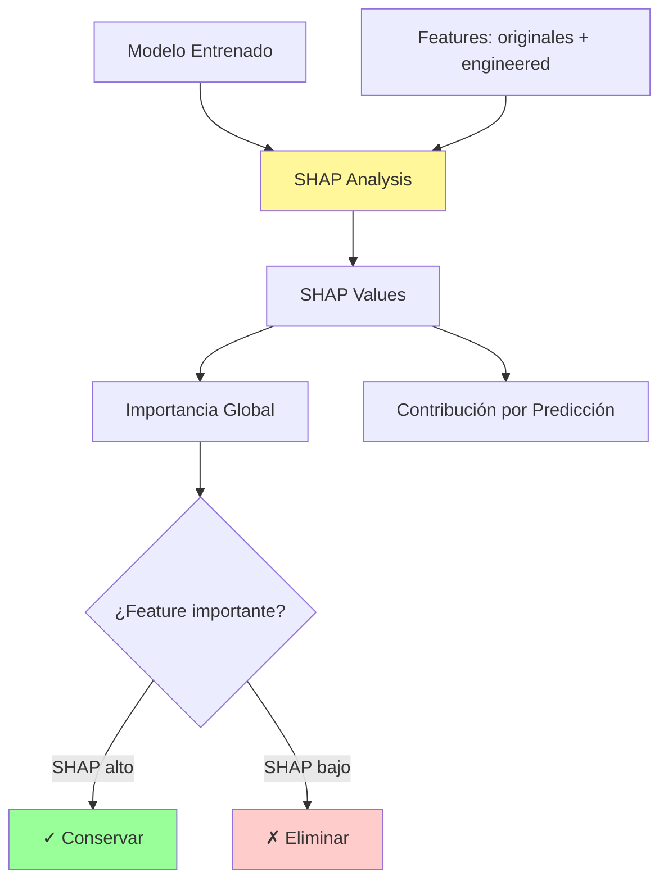

**SHAP (SHapley Additive exPlanations)** permite:
- ✅ Identificar features más importantes
- ✅ Validar que las nuevas features aportan valor
- ✅ Eliminar features redundantes

```python
import shap

# Calcular importancia
explainer = shap.TreeExplainer(model)
shap_values = explainer.shap_values(X_test)

# Visualizar
shap.summary_plot(shap_values, X_test)
```

#### Pipeline Completo

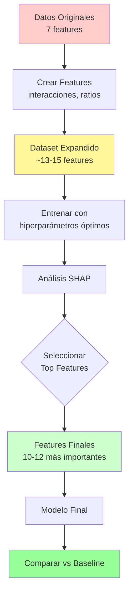

#### Objetivo en este Proyecto

**Features a crear:**
1. **Sinergia de nutrientes**: N×P×K, N×P
2. **Estrés ambiental**: temperature×humidity
3. **Balance nutricional**: N/P, K/P, N/K
4. **Agregaciones**: promedios, desviaciones

**Comparación esperada:**

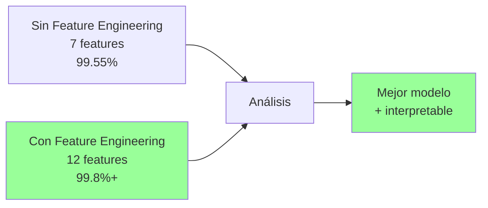

---

## 📊 Características del Dataset

| Característica | Tipo | Descripción | Unidad |
|---------------|------|-------------|--------|
| N | Numérico | Contenido de Nitrógeno | kg/ha |
| P | Numérico | Contenido de Fósforo | kg/ha |
| K | Numérico | Contenido de Potasio | kg/ha |
| temperature | Numérico | Temperatura | °C |
| humidity | Numérico | Humedad | % |
| ph | Numérico | Valor de pH | - |
| rainfall | Numérico | Precipitación | mm |
| label | Categórico | Tipo de cultivo | 22 clases |

### 🌱 Cultivos Incluidos (22 clases)

Arroz, Maíz, Garbanzo, Frijol, Guisante, Frijol Polilla, Frijol Mungo, Granada, Plátano, Mango, Uvas, Algodón, Yute, Gramo Negro, Sandía, Melón, Manzana, Naranja, Papaya, Coco, Lenteja, Café

## 📈 Criterios de Éxito

### Técnicos
- ✅ Accuracy ≥ 95%
- ✅ Precision y Recall ≥ 90% por clase
- ✅ F1-Score ≥ 90%
- ✅ Modelo interpretable

### De Negocio
- ✅ Recomendaciones accionables
- ✅ Tiempo de predicción < 1 segundo
- ✅ Sistema escalable
- ✅ Confianza del usuario (explicabilidad)

## 🛠️ Tecnologías Utilizadas

- **Lenguaje**: Python 3.12+
- **Análisis de Datos**: pandas, numpy
- **Visualización**: matplotlib, seaborn, plotly
- **Machine Learning**: scikit-learn, xgboost, lightgbm
- **Interpretabilidad**: SHAP
- **Notebooks**: Jupyter Lab
- **Control de versiones**: Git

## 📝 Guía de Contribución

1. Fork el proyecto
2. Crear una rama (`git checkout -b feature/nueva-caracteristica`)
3. Commit cambios (`git commit -m 'Agregar nueva característica'`)
4. Push a la rama (`git push origin feature/nueva-caracteristica`)
5. Crear Pull Request

## 👥 Autor(es)

- Daniel Alejandro Garcia Zuluaica
- Elizabeth Toro Chalarca
- Edward Alejandro Rayo Cortés

**Universidad**: EAFIT
**Curso**: Aprendizaje de Máquina Aplicado

## 📚 Referencias

1. IBM SPSS Modeler. (2012). *CRISP-DM Guide*. IBM Corporation.
2. Crop Recommendation Dataset. Kaggle. https://www.kaggle.com/datasets/atharvaingle/crop-recommendation-dataset
3. Scikit-learn Documentation. https://scikit-learn.org/
4. Lundberg, S. M., & Lee, S. I. (2017). *A unified approach to interpreting model predictions*. NeurIPS.

## 📄 Licencia

Este proyecto es un trabajo académico para el curso de Aprendizaje de Máquina Aplicado en EAFIT.

## 🤝 Agradecimientos

- Profesor: Marco Terán
- Universidad EAFIT
- Comunidad de Kaggle por el dataset

---

**Última actualización**: Septiembre 2025

**Estado del Proyecto**: 🚧 En desarrollo