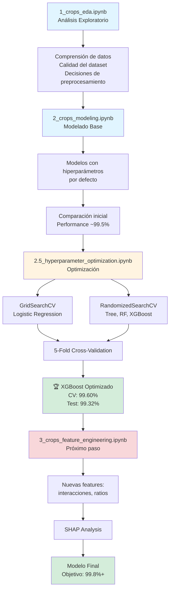

# Notebooks - Sistema de Recomendación de Cultivos

Este directorio contiene los notebooks principales del proyecto de Machine Learning para la recomendación de cultivos agrícolas.

---

## Notebooks

### 1. `1_crops_eda.ipynb` - Análisis Exploratorio de Datos (EDA)

Este notebook contiene un análisis exploratorio completo del dataset de recomendación de cultivos.

**Contenido principal:**

- **Comprensión del negocio**: Planteamiento del problema agrícola y definición de métricas de éxito
- **Obtención y comprensión de datos**: Carga del dataset con 2,200 muestras de 22 cultivos diferentes
- **Análisis Univariado**:
  - Análisis de 7 variables numéricas (N, P, K, temperatura, humedad, pH, precipitación)
  - Análisis de la variable objetivo (22 tipos de cultivos)
  - Detección de outliers y valores faltantes
- **Análisis Multivariado**:
  - Matriz de correlación entre variables
  - Reducción dimensional (PCA y t-SNE)
  - Análisis de separabilidad de clases
- **Decisiones de preprocesamiento**: Estrategias para la preparación de datos

**Hallazgos clave:**
- Dataset de alta calidad sin valores faltantes
- Perfecto balance de clases (100 muestras por cultivo)
- Outliers válidos con significado agronómico
- Buena separabilidad entre cultivos (Silhouette Score t-SNE = 0.528)

---

### 2. `2_crops_modeling.ipynb` - Modelado y Evaluación

Este notebook implementa y compara diferentes algoritmos de Machine Learning para la clasificación de cultivos.

**Contenido principal:**

- **Preparación de datos**:
  - División estratificada del dataset (80% entrenamiento, 20% prueba)
  - Transformación y escalamiento según el tipo de modelo
  - Encoding de la variable objetivo

- **Entrenamiento de modelos**:
  - Implementación de 4 algoritmos diferentes
  - Evaluación de métricas (Accuracy, Precision, Recall, F1-Score)
  - Análisis de matrices de confusión

- **Comparación de resultados**:
  - Ranking de modelos por desempeño
  - Análisis de fortalezas y debilidades de cada algoritmo
  - Selección del mejor modelo

**Modelos implementados:**
1. Decision Tree (Árbol de Decisión)
2. Random Forest (Bosque Aleatorio)
3. Logistic Regression (Regresión Logística)
4. XGBoost (Extreme Gradient Boosting)

**Resultados:**
- Mejor modelo: XGBoost (con hiperparámetros por defecto)
- Performance inicial: ~99.5% accuracy
- Enlace al notebook de optimización: `2.5_hyperparameter_optimization.ipynb`

---

### 2.5. `2.5_hyperparameter_optimization.ipynb` - Optimización de Hiperparámetros

Este notebook se enfoca en la optimización sistemática de hiperparámetros de los modelos entrenados en el notebook 2, con el objetivo de mejorar el rendimiento del 99.55% al 99.8%+.

**Contenido principal:**

- **Técnicas de optimización**:
  - GridSearchCV para Logistic Regression (búsqueda exhaustiva)
  - RandomizedSearchCV para Decision Tree, Random Forest y XGBoost (búsqueda aleatoria)
  - 5-Fold Cross-Validation para scores robustos

- **Hiperparámetros optimizados**:
  - **Logistic Regression**: C, penalty, solver
  - **Decision Tree**: max_depth, min_samples_split, min_samples_leaf, criterion
  - **Random Forest**: n_estimators, max_depth, min_samples_split, min_samples_leaf, max_features
  - **XGBoost**: learning_rate, max_depth, n_estimators, subsample, colsample_bytree, gamma

- **Comparación y selección**:
  - Comparación de todos los modelos optimizados
  - Visualizaciones de performance
  - Selección automática del mejor modelo
  - Guardado de modelos optimizados

**Resultados de optimización:**

🏆 **Modelo ganador: XGBoost**
- CV Score: 99.60%
- Test Accuracy: 99.32%
- Test F1-Score: 99.33%

**Hiperparámetros optimizados de XGBoost:**
```python
n_estimators=200        # Optimizado: 100 → 200
max_depth=5             # Optimizado: 6 → 5
learning_rate=0.1       # Sin cambio
subsample=1.0           # Optimizado: agregado
colsample_bytree=0.7    # Optimizado: 1.0 → 0.7
gamma=0.1               # Optimizado: 0 → 0.1
```

**Conceptos clave explicados:**

- **GridSearchCV vs RandomizedSearchCV**: Cuándo usar cada técnica
- **K-Fold Cross-Validation**: Por qué es mejor que Hold-out simple
- **Espacio de hiperparámetros**: Cómo definir rangos de búsqueda
- **Validación sin data leakage**: Uso correcto del Test Set

---

## Modelos de Machine Learning Explicados

A continuación se presenta una explicación didáctica de cada modelo utilizado en el proyecto, diseñada para personas que están aprendiendo Machine Learning.

---

### 1. Decision Tree (Árbol de Decisión)

#### ¿Qué es?

Un árbol de decisión es un modelo de aprendizaje supervisado que toma decisiones mediante una serie de preguntas en forma de árbol. Es como un diagrama de flujo que va dividiendo los datos según características específicas hasta llegar a una clasificación final.

#### ¿Cómo funciona?

1. **División recursiva**: El algoritmo selecciona la característica (feature) que mejor separa los datos en cada nodo
2. **Criterio de división**: Usa métricas como **Gini** o **Entropía** para decidir cómo dividir
3. **Hojas del árbol**: Los nodos finales (hojas) representan la clase predicha

**Ejemplo aplicado a cultivos:**
```
¿Potasio (K) > 50?
├── Sí: ¿Temperatura > 25°?
│   ├── Sí: Predicción → Banana
│   └── No: Predicción → Papa
└── No: ¿pH < 6.5?
    ├── Sí: Predicción → Café
    └── No: Predicción → Trigo
```

#### Puntos relevantes para aprender ML

**Ventajas:**
- Muy fácil de interpretar y visualizar
- No requiere normalización de datos
- Captura relaciones no lineales
- Maneja tanto variables numéricas como categóricas

**Desventajas:**
- Tendencia al **overfitting** (sobreajuste): memoriza los datos de entrenamiento
- Inestable: pequeños cambios en los datos pueden cambiar drásticamente el árbol
- Sesgado hacia características con más categorías

**Cuándo usarlo:**
- Cuando necesitas un modelo interpretable
- Para exploración inicial de datos
- Cuando tienes datos categóricos y numéricos mezclados

---

### 2. Random Forest (Bosque Aleatorio)

#### ¿Qué es?

Random Forest es un **ensemble** (conjunto) de múltiples árboles de decisión que trabajan juntos. Es como tener un comité de expertos donde cada uno da su opinión y la decisión final se toma por votación mayoritaria.

#### ¿Cómo funciona?

1. **Bootstrap Aggregating (Bagging)**: Crea múltiples subconjuntos aleatorios de los datos
2. **Entrenamiento paralelo**: Entrena un árbol de decisión independiente con cada subconjunto
3. **Random Feature Selection**: Cada árbol solo considera un subconjunto aleatorio de características
4. **Votación**: Para clasificación, la clase más votada gana; para regresión, se promedia

**Ejemplo:**
```
Dataset de cultivos (2,200 muestras)
    ↓
100 árboles entrenados con:
- Árbol 1: 1,760 muestras aleatorias, 5 variables aleatorias
- Árbol 2: 1,760 muestras aleatorias, 5 variables aleatorias
- ...
- Árbol 100: 1,760 muestras aleatorias, 5 variables aleatorias
    ↓
Predicción final: Votación mayoritaria
- 68 árboles → Arroz
- 25 árboles → Maíz
- 7 árboles → Trigo
Resultado: Arroz
```

#### Puntos relevantes para aprender ML

**Ventajas:**
- **Reduce overfitting**: Al promediar muchos árboles, el modelo generaliza mejor
- Muy robusto: maneja outliers y datos faltantes
- Importancia de características: indica qué variables son más relevantes
- No requiere normalización de datos
- Alto accuracy en la mayoría de problemas

**Desventajas:**
- Menos interpretable que un solo árbol
- Más lento de entrenar que un solo árbol
- Requiere más memoria (almacena múltiples árboles)

**Hiperparámetros clave:**
- `n_estimators`: Número de árboles (más árboles = mejor rendimiento pero más lento)
- `max_depth`: Profundidad máxima de cada árbol
- `max_features`: Número de características a considerar en cada división

**Cuándo usarlo:**
- Cuando necesitas alto rendimiento con mínimo esfuerzo
- Ideal para datasets con muchas características
- Excelente opción como baseline fuerte

---

### 3. Logistic Regression (Regresión Logística)

#### ¿Qué es?

A pesar del nombre "regresión", es un algoritmo de **clasificación**. Predice la probabilidad de que una muestra pertenezca a una clase aplicando una función sigmoide a una combinación lineal de las características.

#### ¿Cómo funciona?

1. **Combinación lineal**: Calcula un puntaje como `z = w₁×N + w₂×P + w₃×K + ... + b`
2. **Función sigmoide**: Convierte el puntaje en una probabilidad entre 0 y 1
   ```
   Probabilidad = 1 / (1 + e^(-z))
   ```
3. **Clasificación multiclase**: Usa estrategias como **One-vs-Rest** o **Softmax**

**Ejemplo aplicado a cultivos:**
```
Muestra: N=90, P=42, K=43, temp=20.88, humidity=82, pH=6.5, rainfall=202.94

Cálculo para "Arroz":
z_arroz = 0.5×90 + 0.3×42 - 0.2×43 + ... = 2.5
P(Arroz) = 1/(1 + e^(-2.5)) = 0.92 (92%)

Cálculo para "Maíz":
z_maíz = -0.3×90 + 0.5×42 + 0.1×43 + ... = -1.2
P(Maíz) = 1/(1 + e^(1.2)) = 0.23 (23%)

Predicción: Arroz (mayor probabilidad)
```

#### Puntos relevantes para aprender ML

**Ventajas:**
- Muy rápido de entrenar
- Probabilístico: da probabilidades de pertenencia a cada clase
- Interpretable: los coeficientes indican la importancia de cada variable
- Funciona bien con datos linealmente separables
- Pocas probabilidades de overfitting

**Desventajas:**
- Asume relación **lineal** entre características y log-odds
- No captura interacciones complejas sin ingeniería de características
- Sensible a outliers y escala de datos (requiere normalización)
- Bajo rendimiento si las clases no son linealmente separables

**Preprocesamiento necesario:**
- Normalización/estandarización de datos (RobustScaler, StandardScaler)
- Transformación de variables asimétricas (PowerTransformer)

**Cuándo usarlo:**
- Como baseline simple y rápido
- Cuando necesitas probabilidades interpretables
- Problemas con relaciones lineales
- Cuando tienes pocas muestras

---

### 4. XGBoost (Extreme Gradient Boosting)

#### ¿Qué es?

XGBoost es un algoritmo de **ensemble** basado en **boosting** que construye árboles de decisión de forma **secuencial**, donde cada árbol intenta corregir los errores del anterior. Es uno de los algoritmos más potentes y ganadores de competencias de Kaggle.

#### ¿Cómo funciona?

**Diferencia clave con Random Forest:**
- **Random Forest (Bagging)**: Árboles **paralelos** independientes, votan
- **XGBoost (Boosting)**: Árboles **secuenciales** que corrigen errores

**Proceso:**
1. **Árbol inicial**: Predice con un modelo simple
2. **Calcular errores (residuos)**: Identifica qué muestras se predijeron mal
3. **Nuevo árbol**: Se enfoca en las muestras con mayor error
4. **Actualizar predicción**: Predicción = Predicción anterior + (learning_rate × Nuevo árbol)
5. **Repetir**: Construir 100-1000 árboles de forma iterativa

**Ejemplo simplificado:**
```
Iteración 1:
  Predicción inicial: Arroz
  Error real: Debería ser Maíz
  Peso de error: 1.0

Iteración 2:
  Nuevo árbol aprende: "Si N > 80 y K < 40 → Maíz (peso 1.0)"
  Predicción actualizada: 0.7×Arroz + 0.3×Maíz → Maíz
  Error reducido: 0.3

Iteración 3:
  Nuevo árbol afina: "Si pH > 7 → Maíz (peso 0.3)"
  Error reducido: 0.1

... (100+ iteraciones)
Predicción final: Maíz (con alta confianza)
```

#### Puntos relevantes para aprender ML

**Ventajas:**
- **State-of-the-art**: Uno de los mejores algoritmos para datos tabulares
- Altísimo rendimiento (accuracy)
- Maneja datos faltantes automáticamente
- Regularización incorporada (previene overfitting)
- Muy rápido gracias a optimizaciones paralelas
- Importancia de características

**Desventajas:**
- Muchos hiperparámetros (curva de aprendizaje pronunciada)
- Riesgo de overfitting si no se ajusta correctamente
- Menos interpretable que árboles individuales
- Requiere más tiempo de ajuste (hyperparameter tuning)

**Hiperparámetros clave:**
- `n_estimators`: Número de árboles (100-1000, más = mejor pero más lento)
- `max_depth`: Profundidad máxima (3-10, controla complejidad)
- `learning_rate` (eta): Qué tanto aporta cada árbol (0.01-0.3)
  - Alto (0.3): Aprende rápido, riesgo de overfitting
  - Bajo (0.01): Aprende lento, más robusto, requiere más árboles
- `subsample`: Fracción de muestras para entrenar cada árbol (0.8)
- `colsample_bytree`: Fracción de características por árbol (0.8)

**Cuándo usarlo:**
- Cuando necesitas el máximo rendimiento
- Competencias de Machine Learning
- Datos tabulares con relaciones complejas
- Como modelo final después de explorar otros

---

## Comparación Rápida de Modelos

| Criterio | Decision Tree | Random Forest | Logistic Reg. | XGBoost |
|----------|---------------|---------------|---------------|---------|
| **Interpretabilidad** | Alta | Media | Alta | Media |
| **Rendimiento** | Medio | Alto | Medio | Muy Alto |
| **Velocidad entrenamiento** | Rápida | Media | Muy Rápida | Media |
| **Velocidad predicción** | Rápida | Media | Muy Rápida | Rápida |
| **Requiere normalización** | No | No | Sí | No |
| **Maneja no-linealidad** | Sí | Sí | No | Sí |
| **Riesgo de overfitting** | Alto | Bajo | Muy Bajo | Medio |
| **Tamaño dataset ideal** | Pequeño-Medio | Medio-Grande | Pequeño-Grande | Medio-Grande |

---

## Flujo de Trabajo Típico en ML

1. **Exploración (EDA)** → `1_crops_eda.ipynb`
   - Entender los datos
   - Detectar problemas
   - Decidir preprocesamiento

2. **Baseline simple** → Logistic Regression
   - Modelo rápido y fácil
   - Establece punto de comparación

3. **Modelos intermedios** → Decision Tree, Random Forest
   - Explorar rendimiento sin mucho tuning

4. **Modelos avanzados** → XGBoost
   - Máximo rendimiento
   - Requiere ajuste cuidadoso

5. **Evaluación y selección** → `2_crops_modeling.ipynb`
   - Comparar métricas
   - Analizar matrices de confusión
   - Seleccionar modelo final

---

## Métricas de Evaluación

Para un problema de clasificación multiclase (22 cultivos), las métricas clave son:

- **Accuracy**: Porcentaje de predicciones correctas
  - Fórmula: (Predicciones Correctas) / (Total de Predicciones)
  - Interpretación: 95% accuracy = 95 de cada 100 predicciones son correctas

- **Precision (por clase)**: De lo que predije como "Arroz", ¿cuánto fue realmente Arroz?
  - Fórmula: Verdaderos Positivos / (Verdaderos Positivos + Falsos Positivos)
  - Importante para evitar recomendar cultivos inadecuados (costo económico)

- **Recall (por clase)**: De todos los "Arroz" reales, ¿cuántos detecté?
  - Fórmula: Verdaderos Positivos / (Verdaderos Positivos + Falsos Negativos)
  - Importante para no perder oportunidades de cultivos viables

- **F1-Score**: Promedio armónico de Precision y Recall
  - Fórmula: 2 × (Precision × Recall) / (Precision + Recall)
  - Balancea ambas métricas

- **Matriz de Confusión**: Muestra qué cultivos se confunden entre sí
  - Útil para identificar pares de cultivos problemáticos

---

## Recursos Adicionales

Para profundizar en Machine Learning, se recomiendan:

- **Scikit-learn Documentation**: https://scikit-learn.org/
- **XGBoost Documentation**: https://xgboost.readthedocs.io/
- **Curso**: "Machine Learning" de Andrew Ng (Coursera)
- **Libro**: "Hands-On Machine Learning" de Aurélien Géron
- **Kaggle**: Plataforma para practicar con datasets reales

---

## Estructura del Proyecto

```
notebooks/
├── 1_crops_eda.ipynb                      # Análisis Exploratorio de Datos
├── 2_crops_modeling.ipynb                 # Modelado y Evaluación (modelos base)
├── 2.5_hyperparameter_optimization.ipynb  # Optimización de Hiperparámetros
└── README.md                              # Este archivo
```

## Flujo de Trabajo del Proyecto



---

**Proyecto desarrollado para el curso de Machine Learning Aplicado - EAFIT University**

**Integrantes:**
- Daniel Alejandro Garcia Zuluaica
- Edward Alejandro Rayo Cortés
- Elizabeth Toro Chalarca

